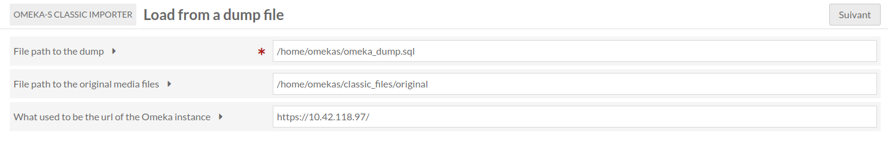

ClassicImporter (module for Omeka S)
===============================

[ClassicImporter] is a module for [Omeka S] and will allow an administrator to import item sets, items and media from a database dump of an Omeka instance.

Installation
------------

See general end user documentation for [Installing a module](http://omeka.org/s/docs/user-manual/modules/#installing-modules).

Usage
-----

To use the module, you first need an Omeka (classic) instance of your choice, then you need to create database dump from that.
The module is not made to create the dump, the administrator needs to do it by themself.

The dump then needs to be uploaded to the Omeka-S instance (anywhere Omeka-S can reach).
The module also is not made to upload the dump.sql file to the Omeka-S instance. It needs to be done by an administrator beforehand.

The media files contained in omeka/files/original must also be uploaded (anywhere Omeka-S can reach) if you want the media to be imported.

Lastly, a MySQL temporary database with a user having permissions on it must be created to import the dump.
Here is what the SQL commands should look like more or less, to be executed as root:
```bash
sudo mysql -uroot
[MySQL] > CREATE USER 'tempdb'@'%' IDENTIFIED BY 'password';
[MySQL] > CREATE DATABASE tempdb;
[MySQL] > GRANT ALL PRIVILEGES ON tempdb.* TO 'tempdb'@'%';
```

It is needed because the default user (omekas) does not have enough permissions to do that.
If you wish to use a different name than "tempdb" or "password", please change the config/module.config.php file accordingly.
```php
    // This is in config/module.config.php
    'classicimporter' => [
        'tempdb_credentials' => [
            "username" => "tempdb",
            "password" => "password",
            "hostname" => "localhost",
            "database" => "tempdb",
        ]
    ]
```

Once all done, you may find, in the "ClassicImporter" tab, a form to get the path to the dump file, the path to the media files and the Omeka URL. The Omeka URL does not need to work, it is used to replace the text like my-omeka-classic.com to my-omeka-s.com in resource values. Fill in the form. You will then be able to see what properties and resource classes can be mapped to import them. All values set on properties that are NOT mapped will NOT be imported!

Use "Import collections" if you want to import item sets.
Use "Update" if you want to update from your precedent dump import. Previously imported resources with matching ids will therefore be updated accordingly.
Use "Import Item sets tree" if the dump contains CollectionsTree information that can be imported.

For each property, you may select "Clean HTML" to clear HTML content from the property values. If `dcterms:title` is `<strong>Hello!</strong>`, "Clean HTML" will only keep `Hello !`.

For each property, you can also check "Map URIs". This means that if `dcterms:description` is `my-omeka-classic.com/show/items/5/`, the value will be imported as a URI to the corresponding imported item. If unchecked, the link will be kept like it was.
Checking this checkbox will also import values like `<a href="https://example.com">My link!</a>` as a link rather than HTML content.

Finally, if no errors, all the imported resources should be on your Omeka-S instance.

Example
-------




Warning
-------

Use it at your own risk.

It’s always recommended to backup your files and your databases and to check your archives regularly so you can roll back if needed.

If you don't know what you're doing, you're probably not the target audience for this module. It should only be used by administrators.

Troubleshooting
---------------

See online issues on the [Omeka forum] and the [module issues] page on GitHub.


Contact
-------

Current maintainers:

* BibLibre
* [Abel B.]


All rights not expressly granted are reserved.

* Copyright Biblibre, 2026-present

[ClassicImporter]: https://github.com/biblibre/ClassicImporter
[Omeka S]: https://omeka.org/s
[Omeka forum]: https://forum.omeka.org/c/omeka-s/modules
[module issues]: https://github.com/omeka-s-modules/CSVImport/issues
[GNU/GPL v3]: https://www.gnu.org/licenses/gpl-3.0.html
[Abel B.]: https://github.com/Bebel00
