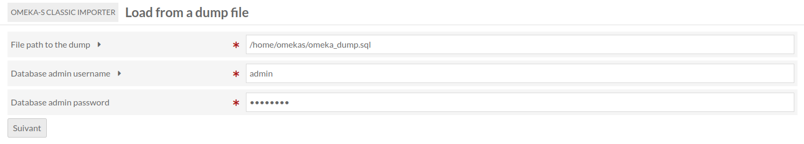
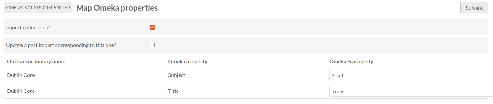

ClassicImporter (module for Omeka S)
===============================

[ClassicImporter] is a module for [Omeka S] and will allow an administrator to import item sets, items and media from a database dump of an Omeka instance.

Installation
------------

See general end user documentation for [Installing a module](http://omeka.org/s/docs/user-manual/modules/#installing-modules).

Usage
-----

To use the module, you first need an Omeka (classic) instance of your choice, then you need to create database dump from that.
The module is not made to create the dump, the administrator needs to do it by themself.

The dump then needs to be uploaded to the Omeka-S instance (anywhere Omeka-S can reach).
The module also is not made to upload the dump to the Omeka-S instance. It needs to be done by an administrator beforehand.

Lastly, if not already existing, a MySQL administrator user with all (*.*) permissions MUST be created beforehand.
This user will be used by the module to create a new database to receive the dump.
It is needed because the default user (omekas) does not have enough permissions to do that.
DO NOT use 'root' user as it will not work. This user is special and cannot be used by PHP.

Once all done, you may find, in the "ClassicImporter" tab, a form to get the path to the dump file and the SQL admin credentials. Fill in the form. You will then be able to see what properties and resource classes can be mapped to import them. All values set on properties that are NOT mapped will NOT be imported!

Use "Import collections" if you want to import item sets.
Use "Update" if you want to update from your precedent dump import. Previously imported resources with matching ids will therefore be updated accordingly.

Finally, if no errors, all the imported resources should be on your Omeka-S instance.

Example
-------

Warning
-------

Use it at your own risk.

It’s always recommended to backup your files and your databases and to check your archives regularly so you can roll back if needed.

Troubleshooting
---------------

See online issues on the [Omeka forum] and the [module issues] page on GitHub.

Contact
-------

Current maintainers:

* BibLibre

All rights not expressly granted are reserved.

* Copyright Biblibre, 2026-present

[ClassicImporter]: https://github.com/biblibre/ClassicImporter
[Omeka S]: https://omeka.org/s
[Omeka forum]: https://forum.omeka.org/c/omeka-s/modules
[module issues]: https://github.com/omeka-s-modules/CSVImport/issues
[GNU/GPL v3]: https://www.gnu.org/licenses/gpl-3.0.html
